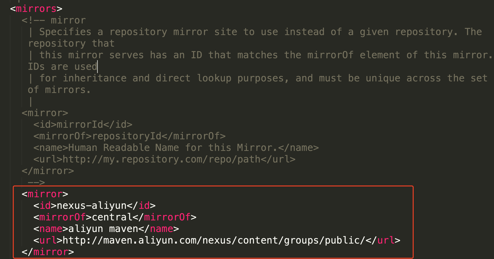
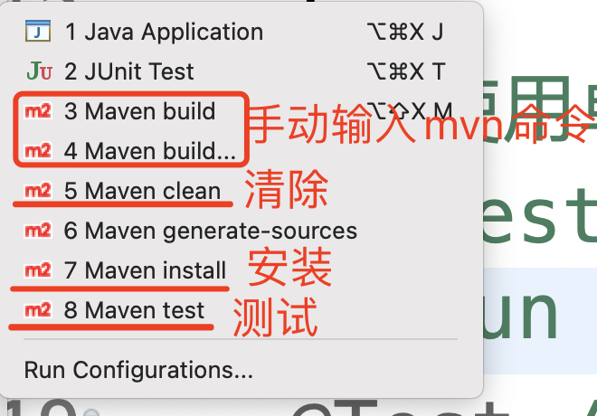

# 项目实训

## 环境

推荐配置

JDK1.8（已安装）、mysql8（部分安装）、navicat不要求、maven 3.6（未安装）

IDE：

​	idea（自行解决配置问题，如果时间充足，老师也会演示）  

​	eclipse（大多数，决定课上以eclipse为配置目标） 

下载地址

```
例子：如果在没有老师的时候可以找到对应的开发软件和环境 -> 官网
mysql（不做统一安装，因为很多学生已经安过了，有问题的下来可以问我，课上可以随时问各班的指导老师）：	
	zip版：https://dev.mysql.com/downloads/mysql/
	msi版：https://dev.mysql.com/downloads/installer/
	安装教程：https://m.runoob.com/mysql/mysql-install.html
maven：
	https://maven.apache.org/docs/history.html
```

## maven的安装和使用

### 什么是maven

是Apache旗下一款开源、免费并且以Java编写的软件，主要作用是管理整个软件的项目过程和管理项目中其他依赖。

### 安装步骤

1、将下载好的zip包解压到一个你找得到的英文路径下面；

2、配置环境变量（类似于java环境变量的配置）

​	复习：配置Java环境变量的时候，配置了几个呢？（弹幕回答：两个，home和path）

​	MAVEN_HOME ：mavan的安装路径

​	Path ：%MAVEN_HOME%/bin

​	先自己回忆配置，如果有问题，在群里抛出来，有专门的辅导老师帮助大家解决

3、很多开发软件的使用都是一样的，下载压缩包，解压到英文路径下，配置环境变量。

​	测试是否配置成功：

​	win+r 输入 cmd 打开终端，输入mvn，将截图发到公屏上。

​	只要不是出现：mvn不是内部或外部命令，都算正确。

### 仓库的概念

maven仓库主要就是用来保存项目中使用到的jar包的

- 本地仓库：指的是在本地创建一个文件夹用来保存所有的jar包
- 远程仓库：maven官方提供的服务器，里面包含了所有可能用到的jar包，官方了还提供了一个远程仓库访问的web页面，方便程序员查找使用
  - 地址https://mvnrepository.com/
- 私有仓库：一般公司内部使用，可以提高依赖的访问速度

关系：不管什么情况，优先访问本地仓库，当本地仓库不存在需要的jar包的时候，再去访问私有仓库和远程仓库进行下载。

### 配置maven

###### 配置仓库

本地仓库有默认路径，也有默认的配置文件，都在c盘下用户文件夹的隐藏文件夹 .m2中，所以一般会进行修改。

修改本地仓库的位置，在eclipse中导入的时候，指定我们定义的配置文件即可。

0、在一个你找得到的英文路径下面创建一个空文件夹，名字可以取为【maven_repo】

1、打开maven安装路径下的 【conf】 文件夹，打开【setting.xml】文件  --> 这个文件就是将来要用到的配置文件。

2、在大约49 - 54行的位置，解开\<localRepository\>的注释，在内部定义好【maven_repo】的绝对路径

​	举例子：

```xml
<localRepository>D:/maven/maven_repo</localRepository>
```

##### 配置镜像源

因为中央仓库的访问速度较慢，我们一般会配置一个国内的镜像源，这里推荐阿里的镜像源。

1、复制景象源代码

```xml
<mirror> 
	<id>nexus-aliyun</id> 
	<!-- <mirrorOf>*</mirrorOf> -->
  <mirrorOf>central</mirrorOf> 
  <name>aliyun maven</name> 	
  <url>http://maven.aliyun.com/nexus/content/groups/public/</url> 
</mirror>
```

2、在【setting.xml】文件的第147行的\<mirrors\>标签下进行添加

3、添加好之后，如图，保存。



### maven中的坐标

maven在pom文件的配置中，一般通过三个标签值来唯一确定一个jar包，这三个标签值就被称为坐标（GAV）。

- groupId：代表当前实际项目
- artifactId：代表当前项目的子项目或者模块
- version：版本

maven世界中，每一个项目都有一个唯一标识，就是三个GAV坐标。

### 项目结构


#### 使用eclipse集成maven

1、打开eclipse的设置【window】 -> 【Preferences】-> 【maven】展开如下：


2、配置 Installations ， 主要是配置maven的安装路径，选择右上角的Add..，添加maven的安装位置


添加进去之后，勾选上刚刚添加的maven，点击应用


3、配置User Settings，主要是配置【setting.xml】的位置和本地仓库的位置


#### 使用eclipse创建maven项目

选择【file】-> 【new】 -> 【maven project】，或者可以在下面的【Other】中搜索maven


勾选创建简单的maven项目，然后下一步


填写项目的一些基本配置


点击Finish之后，大家是第一次使用maven，时间会比较长一点，因为要下载一些必须的内容，可以在eclipse的右下角看到下载进度，切记，一定要保证有网，下载成功之后，整体的项目结构如下：


#### 修改新建maven项目中的一些小问题

1、复制配置信息

```xml
<properties> 
  <project.build.sourceEncoding>UTF-8</project.build.sourceEncoding> 
  <maven.compiler.source>1.8</maven.compiler.source> 
  <maven.compiler.target>1.8</maven.compiler.target> 
</properties>
```

2、粘贴到【pom.xml】文件中，粘贴成功之后记得保存（ctrl+s）


3、更新maven项目

右键项目名称 -> 【maven】 -> 【update project】选项

进入之后，点击【ok】即可。

#### 向maven项目中添加依赖

1、准备依赖的配置语句，是一段xml形式的GAV坐标，一般由老师提供，也可以自己去maven的中央仓库选择自己喜欢的进行粘贴

```xml
<!--  单元测试jar包 -->
<dependency> 
  <groupId>junit</groupId> 
  <artifactId>junit</artifactId> 
  <version>4.13</version> 
  <scope>test</scope> 
</dependency>
```

2、在【pom.xml】中的根标签\<project\>新建子标签\<dependencies\>，在标签内部提供了很多\<dependency\>，这些就是我们项目中所依赖的jar包

#### 编码

1、新建Java主代码

在src/main/java下新建包com.briup.hello，在包中新建类HelloUtils.java

```java
package com.briup.hello;

public class HelloUtils {
	public static void sayHello(String name) {
		System.out.println("hello, "+name);
	}
}
```

2、新建Java测试代码

在src/test/java下新建包com.briup.hello，在包中新建类HelloUtilsTest.java，完成对HelloUtils的测试

```java
package com.briup.hello;

import org.junit.Test;

/**
 * HelloUtils的测试类
 * @author mastercgx
 *
 */
public class HelloUtilsTest {
	// 使用单元测试的jar包
	@Test // 注解，添加了@Test的方法可以单独直接运行
	public void test1() {
		// 调用HelloUtils静态方法
		HelloUtils.sayHello("tom");
	}
}

```

#### maven中几个常用的命令

eclipse中右键项目，选择【run as】可以看到maven预先提供了一些运行方法



> maven中有哪些命令供我们使用？
>
> - mvn test：执行测试代码
> - mvn clean：清除掉所有的taglib包下面的class文件
> - mvn package：将代码打包，产生一个jar包
> - mvn install：将打的jar包安装到maven的本地仓库，供其他项目引用
> - mvn compile：编译主代码，在taglib包下面产生class文件
> - mvn test-compile：编译测试代码
>
> 

###### test

右键项目，【show in】-> 【Terimnal】 ，打开当前项目所在路径，输入 mvn test，观察结果


结果


###### package

方法同上，执行mvn package即可，观察结果


在项目中的target位置里能找到对应的jar包


###### clean

同样的方法执行 ，mvn clean，可以清除掉target目录里的内容，大家测试，观察结果。

其余的mvn命令都这样去使用。

>生命周期：
>
>==maven声明周期靠后的命令在执行的时候会默认把前面的命令都执行一遍，要注意clean命令属于clean周期，和其他常用命令是独立的，那么不会执行clean，需要单独自己执行。==

#### maven项目中的依赖关系

举例：项目1 引入了 a.jar ，a.jar 中依赖 b.jar

a和b就是直接依赖关系，项目1和a也是直接依赖关系

项目1和b就是间接依赖关系，此时就会发生依赖传递。

如果项目2引用了项目1，那此时关系如下：

项目2 -> 项目1 -> a.jar -> b.jar

依赖是否传递，取决于依赖导入时的\<scope\>

- compile ，会依赖传递
- provided ，不会依赖传递
- runtime ，会依赖传递
- system ，不会依赖传递test ，不会依赖传递
- test ，不会依赖传递

> 结论：
>
> 由于依赖传递导致的依赖冲突，即直接依赖和间接依赖都依赖了相同的jar包，但是版本同，这个时候要选择最短依赖路径，这个是maven自动帮我们做的。

测试：

1、新建maven项目maven_second，在second中引用first项目；

2、如果first项目要被其他项目所引用，要把first项目安装到maven的本地仓库里，昨天学习到的命令

```
mvn install
```

3、使用【Run as】中的【Maven build】来执行。右键项目即可看到。


多个目标之间可以以空格隔开，比如可以输入【clean install】代表先清除，再安装。

安装成功之后，就可以在mavan仓库里按照GAV坐标找到对应jar包

4、引用成功之后可以观察两个项目的依赖情况，注意，得把junit包的范围改为默认，因为test没有办法完成依赖传递。


#### maven项目中的关系

###### 继承关系

###### 聚合关系

## 项目搭建（基本）

以聚合关系来处理实训项目中的结构，依据分析，暂时划分为三个模块

父项目：sxnd_env_project

子模块：env_common（公共模块）、env_client（客户端模块）、env_server（服务器模块）

步骤：

1、新建父项目sxnd_env_project，设置打包方式为pom


2、右键父项目，【new】 -> 【other】，输入maven，选择 【Maven module】


填入相关信息，依次创建三个子模块


3、创建成功之后的效果如下


4、在父项目的pom中，添加处理环境问题的三行代码，更新整个父项目，观察结果。可以看到，在父项目里写一遍，其他的子模块都可以生效。


## 版本控制工具（git）

什么是git

一款开源且免费的版本控制工具。

什么是版本控制工具

下载

https://git-scm.com/download

安装

运行exe文件，一路next，点击完成

验证

1、右键的时候会出现两个工具

2、打开cmd，输入 git --version，观察版本输出，如果提示不是内部或外部命令，需要手动配置环境变量。一般情况下在git的安装过程中就直接配好了。

操作

因为我们是单人独立开发，这里git的作用主要是用来做备份，涉及到以下几个命令：

- git  init 初始化一个本地仓库（任意一个文件夹都可以当仓库）
- git clone 从远程仓库（github/gitee）上完全复制一个项目到本地，作为了解，可以拿到别人的优秀项目，在本次实训中用不到，本次实训主要是推送和拉取自己的项目
- git pull 拉取
- git add 添加
- git comimt 提交
- git push 推送

远程仓库

github：https://github.com 

（推荐）gitee：https://gitee.com

> 完成一个码云账号的注册，5分钟时间。

将本地仓库与远程仓库建立联系，并且推送文件到网络仓库（windows）

1、在桌面上新建一个空白的文件夹 【git-test】，

2、双击打开，右键【Git bash here】，输入以下命令初始化一个本地仓库

```bash
git init
```

3、绑定账号和邮箱

```bash
git config --global user.name "gitee的名字"
git config --global user.email "gitee绑定的邮箱"
```

3、新建一个空白文件，你可以输入

```bash
touch README.md
```

4、将新建的文件添加到本地仓库

```bash
git add README.md
```

5、将添加进去的文件，提交到本地仓库，让修改生效

```bash
git commit -m "提交时的说明"
```

6、建立和远程仓库的连接（这一步一般只做一次，就是第一次的时候）

```bash
git remote add origin 你的仓库地址
```

绑定成功之后，可以通过

```bash
git remote -v
```

进行查看，理论上看到的两个网址都应该和自己的仓库地址是一样的，如果不一样，需要删除掉旧的，才能添加新的。删除命令

```bash
git remote remove origin
```

7、把当前本地的内容提交到网络仓库

```bash
git push -u origin master
```

推送完成之后，刷新gitee的网页，观察是否上传成功。

如果第二次开始，对于【git-test】文件夹中的内容有修改，那么仅需要执行上面的步骤4、5、7不需要其他额外步骤了。

8、如果想要拉取我们自己的项目，可以使用命令

```bash
git pull origin master
```

将远程仓库的内容拉取到本地仓库里

#### 使用git备份我们的实训项目（拓展）

1、在gitee上新建一个正规的远程仓库【sxnd_env_project】

2、将本地项目存在的文件夹初始化为本地仓库

3、和远程仓库进行连接，然后添加内容，提交内容

4、将已有的内容推送到网络仓库进行备份

## 项目搭建（包结构）

env_common：公共的类和接口

​	实体类

​	工具包

​	该项目封装的自定义异常

​	用来定义功能的接口

​	配置模块的实现类和日志模块的实现类

env_client：客户端的主要程序

​	采集日志文件中的信息

​	发送到服务器

env_server：服务器端的主要程序

​	接收客户端发送过来的信息

​	解析信息并且录入到数据库里

创建下来如下


> 提示：由于【client】和【server】都要引用【common】模块，所以要将【common】模块打包安装到maven本地仓库中，并且一旦【common】子模块中有修改，则需要重新打包。记得在【client】和【server】的pom.xml中进行引用。

## 项目需求


### 采集模块

分析得到实体类的写法Environment

```java
package com.briup.env.common.entity;

import java.sql.Timestamp;

/**
 * 环境实体类
 * @author mastercgx
 *
 */
public class Environment {
    // 属性
    // 环境种类的名称（温度、湿度、二氧化碳浓度、光照强度）
    private String name;
    // 电脑端id
    private String srcId;
    // 树莓派id
    private String desId;
    // 试验箱区域模块id
    private String devId;
    // 模块地址
    private String address;
    // 传感器个数
    private int count;
    // 指令编号
    private String cmd;
    // 状态
    private int status;
    // 监测到环境的具体数值
    private float data;
    // 采集时间
    private Timestamp time;
    
    getter & setter 
    allargs & noargs constructor
    toString
}

```

将采集的过程抽象成接口 【Gather.java】

经过分析，采集的方法不需要参数，但是需要一个返回值，用来得到一个数据。一行环境环境记录，就可以得到一个Environment对象，很多条环境记录，就可以得到一个Environment集合，由此可知：

```java
/**
	 * 采集环境数据
	 * @return 环境对象的集合
	 */
public Collection<Environment> gather();
```

实现接口的步骤：

1、将分析的程序1得到的数据（一份日志文件），在程序2（客户端）中使用IO流读取配置文件的内容

​	可以使用的流：文件输入流、缓冲输入流

2、然后再按照格式 “｜”进行分割 字符串

​	分割使用的是字符串的split("分割字符")

​	“｜”是特殊字符，需要进行转译，比较简单易记的格式“[|]”

3、将数据取出来封装成一个对象

​	简单的数据分析

​	[100, 101, 2, 16, 1, 3, 64f4536c02, 1, 1516871785460]

​	第四个数据【16】代表的是传感器的类型，传感器的类型可以决定是哪种环境的数据。

​	16代表是温湿度的数据，也就是说如果传感器是16，里面包含了温度和湿度两项数据，将一行记录拆成两个Environment对象

​	256代表是光照强度的数据

​	1280代表的是二氧化碳浓度的数据

​	第六个数据【64f4536c02】代表的是传感器传回来的环境数据，如果是温湿度，那么需要将此数据处理成温度和湿度的两个值。如果是光照强度和二氧化碳浓度的数据，则无需做拆分处理，直接转换为负点类型的数据放入到对象中即可。

​	了解数据的转换规则，没有必要知道怎么产生的这个公式，直接拿来转换

​	温度公式：**float** f1 = (**float**) (((**float**)v1*0.00268127)-46.85);

​	湿度公式：**float** f2 = (**float**) (((**float**)v2*0.00190735)-6);

​	光照强度和CO2浓度公式：直接将前两个字节的十六进制转换为十进制

4、将多个对象装在集合中返回出去即可

### 网络模块

主要功能是完成数据的传输，由客户端发给服务器。

客户端为发送端

抽象出发送的接口【Client.java】，分析：一个发送的方法需要参数，不需要返回值。

发送的数据可以为对象

```java
/**
	 * 客户端发送方法
	 * @param coll 代表采集到的并且整理好的数据清单
	 */
	public void send(Collection<Environment> coll);
```

服务器为接收端

抽象出发送的接口【Server.java】，分析：一个接收的方法，不需要参数，需要返回值。

```java
/**
	 * 服务器接收方法
	 * @return	返回从客户端收到的数据清单
	 */
	public Collection<Environment> receive();
```

> 如果将一个集合，以IO流的形式从客户端发送到服务器？要用到什么流？流的对象又在哪里呢？
>
> 对象流：对象输入流、对象输出流
>
> 序列化：如果要使用对象流，该对象必须实现序列化；如果该对象是个集合，那么集合中保存的数据类型要实现序列化。
>
> socket中就有输入流和输出流的对象，直接以socket为载体，就可以传输数据。


### 入库模块

主要由服务器端执行，将接收到的数据存入到数据库里，给不同天的数据来划分表。

每一条数据有采集的时间，不同天的数据要放到不同的表中

我们一共有31张表

t_env_1 ... t_env_31

抽象出入库的接口【DbStore.java】，分析：一个入库的方法，有参数，没有返回值

```java
/**
	 * 入库方法
	 * @param 服务器接收回来的数据清单
	 */
	public void dbstore(Collection<Environment> coll);
```

前置知识：

​	JDBC：

​		数据库在发布的时候，都会对应的发布该数据库的驱动。

​		熟练使用jdbc完成增删改查

​		掌握PreparedStatement的使用，包括预处理和批处理

​		了解连接池的概念

​			通过连接池来管理连接对象，不需要频繁开启和关闭资源，提高了资源的利用率。

​			项目中推荐使用Druid，需要使用maven引入依赖

```xml
<!-- 连接池 -->
<!-- https://mvnrepository.com/artifact/com.alibaba/druid -->
<dependency>
    <groupId>com.alibaba</groupId>
    <artifactId>druid</artifactId>
    <version>1.2.15</version>
</dependency>
```

​		对JDBC的使用简单进行封装

​			封装了传统方式获得连接对象的方法

​			封装了连接池方式获得连接对象的方法

​			封装了关闭JDBC常用对象的方法

​	MYSQL数据库：

​		掌握基本的sql语句的写法

​	

1、遍历集合

2、获得每一个Environment对象，提取出该对象的天数数据，决定插入到哪张表中

3、使用jdbc执行插入语句

​	插入的时候要注意：不同天数的数据要插入到不同的表中的

​	env_detail_1 ... env_detail_31

4、由于数据量较大，我们一般会用到jdbc的批处理功能


### 配置模块

为了降低各个模块之间的依赖关系，起到解耦合的效果，提供一个额外的配置模块来完成以下内容：

​	1、解决对象的创建问题，由传统的new变为从配置模块获取。

​	2、提炼出每个模块需要经常变动的数据，保存到配置文件里，随时可以进行修改。

需要解决的问题：

​	1、怎么获得每个模块的相关信息

　2、如何创建每个模块的对象

　3、怎么把每个模块需要的数据注入到模块中

​	4、什么时候可以把自己(配置模块本身)注入到需要的模块中

​	5、怎么样可以把业务模块全部统一起来，拥有相同的功能（方法）

​			1）通过两个类直接的继承关系

​			2）两个类实现同一个接口（选）

用到的技术：

​	1、反射机制

​	2、xml文件的编写和解析（dom4j）

​	3、用map集合保存一个标识和其对应的对象 k :String  v:接口

​			{"gather": new Gather() , "client": new Client()}

步骤：

​	1、新建Configruation接口，抽象获取各个模块对象的方法。

```java
package com.briup.env.common.interfaces;

/**
 * 配置模块接口
 * 主要用于获得其他模块的对象
 * 在获得对象之前将一些基础的配置信息注入到对象里
 * @author mastercgx
 *
 */
public interface Configuration {
	Gather getGather();
	Client getClient();
	Server getServer();
	DbStore getDBDbStore();
}

```

2、新建整个项目的根接口EnvironmentInit，定义该项目除配置模块之外的所有模块的公共行为（注入数据、注入对象）

```java
package com.briup.env.common.interfaces;

import java.util.Properties;

/**
 * 抽象为整个项目的根接口
 * 用来定义整个其他模块的公共行为
 * @author mastercgx
 *
 */
public interface EnvironmentInit {
	/**
	 * 给子模块注入配置信息
	 * properties就是一个小map
	 * @param properties
	 */
	public void init(Properties properties);
	/**
	 * 如果某个子模块中要用到其他的子模块
	 * 可以通过参数的配置模块进行获取
	 * @param configuration
	 */
	public void config(Configuration configuration);
}

```

3、让之前写过的Gather、Client、Server、DbStore都继承自该根接口，对应的实现类中也要添加根接口的为实现的方法。

4、抽离各模块的需要配置的内容，编写一个config.xml的配置文件。

​	采集模块：采集的日志文件的路径

​	网络模块：网络通信的IP和端口

​	入库模块：批处理的条数

```xml
<configuration>
    <!-- 客户端的配置 -->
    <gather class="com.briup.env.client.GatherImpl">
      <fileName>src/main/resources/radwtmp</fileName>
    </gather>
    <client class="com.briup.env.client.ClientImpl">
      <ip>127.0.0.1</ip>
      <port>8888</port>
    </client>
    <!-- 服务器的配置 -->
    <server class="com.briup.env.server.ServerImpl">
      <port>8888</port>
    </server>
    <dbstore class="com.briup.env.server.DbStoreImpl">
      <batchSize>1000</batchSize>
    </dbstore>
</configuration>
```

5、配置模块里书写读取xml文件内容的代码，并且 创建对象，并且注入配置信息和本身。

​	需要引入新的依赖，dom4j，用来解析xml

```xml
<!-- https://mvnrepository.com/artifact/org.dom4j/dom4j -->
<dependency>
    <groupId>org.dom4j</groupId>
    <artifactId>dom4j</artifactId>
    <version>2.1.3</version>
</dependency>
```

6、使用dom4j解析xml文件

​	1）构建解析器

​	2）调用read方法解析。此处是项目中唯一写死文件路径的地方。

​	3）获取root根节点

​	4）获取一级节点

​			需要的数据

​				一级节点的名字，作为map集合的key值

​			   一级节点的class属性，获得每个类的全限定类名，通过反射创建出对应的类的对象，作为map集合的value值

​	5）获取二级节点

​			需要的护具

​				二级节点的名字：作为properties中的property的key值

​				二级节点的值：作为propeties的property的value值

​	6）调用根接口对象的init方法，传入propeties

​	7）调用根接口对象的config方法，传入配置模块的对象，本位置下可以直接使用this

​	8）将所得的key和value保存到map集合中，便于获取其他模块的对象


### 日志模块（log4j）

什么是日志

日志用来记录项目运行过程中的所有信息，错误信息、运行状态信息等等

这些信息可以帮助我们持久化系统的运行过程，快速排除故障。

输出语句和日志的区别

System.out.println("信息")如果过多，在系统部署的时候会影响到效率

日志可以决定是否要部署日志输出、指定哪个包哪个类的日志输出、控制信息输出的级别等等

Log4j，是一款轻量级的日志框架。引入依赖

```xml
<!-- https://mvnrepository.com/artifact/log4j/log4j -->
<dependency>
    <groupId>log4j</groupId>
    <artifactId>log4j</artifactId>
    <version>1.2.17</version>
</dependency>
```

作用：

- ​	控制日志输出
- ​	定义日志级别
- ​	仅需修改配置文件就可以改变功能

使用：

​	1、准备一份配置文件即可 log4j.properties

示例：

```properties
# root settings
log4j.rootLogger = debug,stdout,fileout

# console 
log4j.appender.stdout = org.apache.log4j.ConsoleAppender
log4j.appender.stdout.Target = System.out
log4j.appender.stdout.layout = org.apache.log4j.PatternLayout
log4j.appender.stdout.layout.ConversionPattern = %-d{yyyy-MM-dd HH:mm:ss,SSS} [%-5p] [%t] [%m]%n

# file 
log4j.appender.fileout = org.apache.log4j.DailyRollingFileAppender
log4j.appender.fileout.File = resources/logs/smart-debug.log
log4j.appender.fileout.Append = true
log4j.appender.fileout.Threshold = DEBUG 
log4j.appender.fileout.layout = org.apache.log4j.PatternLayout
log4j.appender.fileout.layout.ConversionPattern = %-d{yyyy-MM-dd HH:mm:ss} [%-5p] [%t] [%m]%n

```

解释：

1. log4j配置文件中必须要配置rootLogger，只能配置一个，后面的内容按逗号隔开，第一个内容为日志的级别，后面的均为日志输出定义的名字

2. 一个logger可以有多个appender，即一个日志可以输出在多个地方，示例中选择了ConsoleAppender（控制台上）和DailyRollingFileAppender（每天产生一个日志文件）

3. 分别对日志的输出stdout进行设置。

   1. stdout输出在控制台上，设置使用System.out

   2. 输出的样式使用的是模版，模版的格式如下：

      [时间] [级别] [产生日志的线程] [输出的小心] 换行
   
4. 分别对日志的输出fileout进行设置。

   1. fileout输出在文件中，要求每天产生一个日志文件，可以定义日志文件的产生位置
   2. Append设置文件里的内容是否追加
   3. 可以设置模版，模版和stdout是一样的

>
>
>一般情况下默认的一些日志级别（log4j支持的日志级别）
>
>debug（调试）  info（信息）  warn（警告）  error（错误）  fatal（奔溃）

​	2、获得log4j相关的类的对象，就可以输出日志了

获得log4j的root logger进行输出

```java
private org.apache.log4j.Logger rootLogger;
	public LoggerImpl() {
		// 获得root logger
		rootLogger = org.apache.log4j.Logger.getRootLogger();
	}
```

套入到自己的方法中即可

```java
@Override
	public void debug(Object msg) {
		rootLogger.debug(msg);
	}

	@Override
	public void info(Object msg) {
		rootLogger.info(msg);
	}

	@Override
	public void warn(Object msg) {
		rootLogger.warn(msg);
	}

	@Override
	public void error(Object msg) {
		rootLogger.error(msg);
	}

	@Override
	public void fatal(Object msg) {
		rootLogger.fatal(msg);
	}
```

3、在适当的位置进行日志的输出

比如

程序运行的过程记录（我们目前项目中所有的输出语句都可以换成日志了）

如果一旦抛出异常，也要记录在日志文件里（我们目前项目中所有的异常处理，也可以换成日志了）

4、注意新的模块进入到项目里，也要被配置模块管理

​	即Logger接口要继承EnvironmentInit接口，这里可以做空实现。

​	在配置模块里提供一个获取日志模块对象的方法


## 拓展内容（自主完成）

1、采集模块中统计信息

- 温度数据多少条
- 湿度数据多少条
- 光照强度数据多少条
- CO2浓度数据多少条
- 共多少条
- 采集共花费多长时间

2、完成从Object到Collection的安全强制类型转换
3、使用JDBC完成更新的操作（使用executeUpdate方法）

​	1）可以更新null值：如果传递的是null值，会把数据库原来的数据覆盖为null值

​	2）不能更新null值：如果传递的是null值，不会修改数据库原来的数据

4、我们现在每一次采集的时候都是采集全部，比如说第一次已经采集过了，那第二次采集的时候还需要采集历史数据吗？

	>答案肯定是不需要的。
	>
	>设计一个逻辑，当采集的日志文件有更新的时候，只采集更新的数据，如果文件没有更新，则提示文件没有更新，无需采集。

5、思考，能不能设计一个逻辑，要求客户端定时或者每隔一段时间检查能不能采集数据，如果能，就采集并且发送，如果不能就不能了。

6、目前我们的服务器只有连接一个客户端，当完成一次逻辑的时候，服务器就关闭了，思考，能不能设计一个逻辑让服务器保持永久不关闭，并且能够一直接收客户端，为客户端提供服务。

7、如果有学过Linux操作系统，或者和其他的小伙伴能够进行网络共同，尝试一台pc做客户端，另外一台pc做服务器，搭建成功之后，完成跨pc的数据传递。

> 如果没有两台pc，可以尝试使用虚拟机（如果会的话）

8、大家学习过jsp，尝试以一个web项目给咱们的客户端和服务器设计一个简单的动态网页，客户端提供一些button，服务器端提供一些数据展示的table和交互的button即可。


